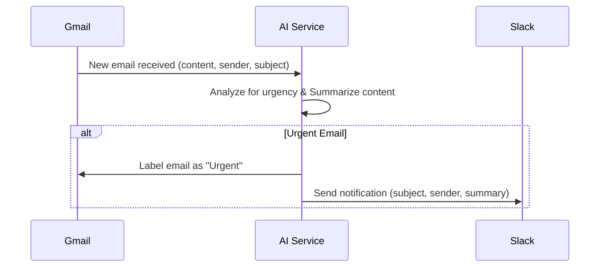

# Email Triage Automation

## 1. Project Overview and Purpose

This project implements an automated email triage system. The system monitors a Gmail inbox, analyzes incoming emails for urgency using an AI service, labels urgent emails in Gmail, and sends notifications for these urgent emails to a specified Slack channel. The primary goal is to help users manage their email inboxes more efficiently by quickly identifying and acting upon urgent messages.

## 2. Workflow

The system follows these steps:

1.  **New Email Arrival:** The system detects a new email in the connected Gmail inbox.
2.  **AI Analysis:** The email's content (subject, sender, body) is sent to an AI service.
3.  **Urgency Determination & Summarization:** The AI service analyzes the email to determine its urgency and generates a concise summary.
4.  **Gmail Labeling (If Urgent):** If the AI service identifies the email as urgent, it instructs the Gmail integration to apply an "Urgent" label to that email.
5.  **Slack Notification (If Urgent):** Simultaneously, the AI service sends the email's subject, sender, and the generated summary to the Slack integration module.
6.  **Notification Delivery:** The Slack integration module formats this information and sends a notification to a pre-configured Slack channel.
7.  **No Action (If Not Urgent):** If the email is deemed not urgent, no labeling or Slack notification occurs.

### Workflow Diagram


*(Diagram based on `requirements/workflow_diagram.png`)*

## 3. Installation Instructions

Detailed installation instructions will be provided as the project components are developed. Generally, this will involve:

1.  **Cloning the Repository:**
    ```bash
    git clone <repository-url>
    cd email-triage-automation
    ```
2.  **Setting up a Python Virtual Environment:**
    ```bash
    python -m venv .venv
    source .venv/bin/activate  # On Windows use `.venv\Scripts\activate`
    ```
3.  **Installing Dependencies:**
    ```bash
    pip install -r requirements.txt
    ```
4.  **Configuration:**
    *   Set up API credentials for Gmail (OAuth 2.0) and Google Cloud Pub/Sub.
    *   Obtain a Slack Bot token.
    *   Configure environment variables (e.g., in a `.env` file) for these credentials, the target Gmail label name, and the Slack channel ID.

## 3.5. Deployment Instructions

This project can be deployed using Docker and Docker Compose. An installation script is provided to simplify the setup.

### Using the Installation Script (Recommended for Linux/macOS)

The `install.sh` script automates several setup steps, including directory creation, environment file setup, and Docker container deployment.

1.  **Ensure Prerequisites:**
    *   Docker and Docker Compose must be installed.
2.  **Run the Script:**
    ```bash
    bash install.sh
    ```
    The script will:
    *   Create `secrets` and `logs` directories if they don't exist.
    *   Copy `.env.example` to `.env` if `.env` doesn't exist, and prompt you to edit it with your credentials.
    *   Check for required Google API credential files (`client_secret.json`, `credentials.json`, `service_account.json`) in the `secrets` directory and prompt you to add them if missing.
    *   Build and start the Docker containers in detached mode using `docker-compose up -d --build`.

    After the script completes, the API should be running at `http://localhost:8000`.

### Manual Docker Deployment

If you prefer or need to deploy manually:

1.  **Clone the Repository:** (If not already done)
    ```bash
    git clone <repository-url>
    cd email-triage-automation
    ```
2.  **Create Directories:**
    ```bash
    mkdir -p secrets logs
    ```
3.  **Configure Environment Variables:**
    *   Copy `.env.example` to `.env`:
        ```bash
        cp .env.example .env
        ```
    *   Edit the `.env` file and fill in all necessary values (API keys, project IDs, Slack tokens, etc.). Refer to `.env.example` for the required variables.
4.  **Add Google API Credentials:**
    *   Place your `client_secret.json` (OAuth 2.0 client secrets), `credentials.json` (OAuth 2.0 tokens, typically generated after first run/authentication), and `service_account.json` (Google Cloud service account key) files into the `secrets/` directory.
5.  **Build and Run with Docker Compose:**
    ```bash
    docker-compose up --build -d
    ```
    This command will build the Docker image as defined in `Dockerfile` and start the service defined in `docker-compose.yml`.

### Accessing the Deployed Application

*   **API Endpoint:** `http://localhost:8000`
*   **API Documentation (Swagger UI):** `http://localhost:8000/api/v1/docs`
*   **Health Check:** `http://localhost:8000/api/v1/health`

### Stopping the Application

To stop the Docker containers:
```bash
docker-compose down
```

### Viewing Logs

To view the logs from the running Docker containers:
```bash
docker-compose logs -f
```

### CI/CD

(Currently, a specific CI/CD pipeline is not defined. This section can be updated as CI/CD processes are implemented.)

## 4. Usage Examples

Once configured and running, the system will automatically process incoming emails.

*   **Receiving an Urgent Email:**
    *   The email will be labeled "Urgent" (or your configured label name) in your Gmail inbox.
    *   You will receive a Slack message in the designated channel containing the email's sender, subject, and a summary.
*   **Receiving a Non-Urgent Email:**
    *   No action will be taken by the automation. The email will remain in your inbox as usual.

## 5. Configuration Options

The following aspects of the system will be configurable, typically via environment variables or a configuration file:

*   **Gmail:**
    *   Credentials (OAuth 2.0 client secrets file, token file paths).
    *   Label name for urgent emails (e.g., "Urgent", "AI-Triage/Urgent").
    *   Google Cloud Pub/Sub project ID and subscription name for real-time email monitoring.
*   **AI Service:**
    *   Choice of NLP model for urgency detection and summarization (if multiple options are implemented).
    *   API keys if using external AI services (e.g., OpenAI).
    *   Thresholds for urgency classification (if applicable).
*   **Slack:**
    *   Bot token.
    *   Target channel ID for notifications.
    *   Notification message format (potentially customizable).

## 6. Components and Modules

The system is comprised of three main components:

### 6.1. Gmail Integration
*   **Responsibilities:**
    *   Monitor the Gmail inbox for new emails (preferably via Google Cloud Pub/Sub push notifications).
    *   Fetch the content (subject, sender, body, ID) of new emails.
    *   Apply a specified label to emails identified as urgent.
*   **Technology/Tools:**
    *   `google-api-python-client`
    *   Gmail API
    *   OAuth 2.0 for authentication
    *   `google-cloud-pubsub` for real-time notifications

### 6.2. AI Service (Urgency Analysis & Summarization)
*   **Responsibilities:**
    *   Analyze email content to determine its urgency.
    *   Generate a concise summary of the email.
*   **Technology/Tools:**
    *   Python
    *   NLP Libraries:
        *   Hugging Face `transformers` (for models like BERT, RoBERTa, BART, T5, Pegasus) for urgency classification and summarization.
        *   `scikit-learn` for simpler ML models (e.g., Naive Bayes, SVM) with TF-IDF features.
        *   (Optional) `openai` library if using OpenAI API.
        *   `nltk` / `spacy` for traditional summarization techniques.

### 6.3. Slack Integration
*   **Responsibilities:**
    *   Send formatted notifications to a specified Slack channel.
    *   Include email subject, sender, and AI-generated summary in the notification.
*   **Technology/Tools:**
    *   `slack-sdk`
    *   Slack API
    *   Bot token for authentication

## 7. Technology Stack

*   **Programming Language:** Python 3.x
*   **Key Libraries/Frameworks:**
    *   `google-api-python-client`
    *   `google-cloud-pubsub`
    *   `slack-sdk`
    *   Hugging Face `transformers` (recommended)
    *   `scikit-learn`
    *   `nltk` / `spacy`
    *   (Optional) `openai`
    *   Web framework (Optional, for Pub/Sub push endpoint): Flask or FastAPI
    *   `python-dotenv` for environment variable management.

## 8. Assumptions and Limitations

### Assumptions
*   User has a functional Gmail account and a Slack workspace.
*   Necessary API credentials (Google Cloud, Slack Bot) can be obtained and securely managed.
*   A Google Cloud Project is available and configured for Pub/Sub.
*   The AI model for urgency detection is either pre-trained and suitable or can be fine-tuned/trained with an appropriate dataset.
*   "Urgency" can be reliably determined by the AI from email content.

### Limitations
*   AI accuracy for urgency and summarization is dependent on model quality and training data.
*   API rate limits for Gmail, Google Cloud Pub/Sub, AI services, and Slack must be considered.
*   Complex email formats (HTML, multipart, attachments) may require additional parsing logic. Attachments are not processed in the current design.
*   Real-time processing may experience minor delays.
*   Robust error handling and retry mechanisms are essential.

## 9. Further Development (Next Steps from Workflow Design)
*   Detailed investigation into setting up Gmail API push notifications with Google Cloud Pub/Sub.
*   Evaluate specific pre-trained models from Hugging Face for text classification (urgency) and summarization.
*   Outline the OAuth 2.0 flow for both Gmail and Slack integrations within a Python application.
*   Define a strategy for acquiring/creating and labeling training data if a custom urgency detection model is required.
*   Establish a deployment environment.
*   Implement comprehensive error logging and monitoring.
*   Develop a clear configuration management strategy.

---

*This README is based on the `requirements/workflow_design.md` document.* 