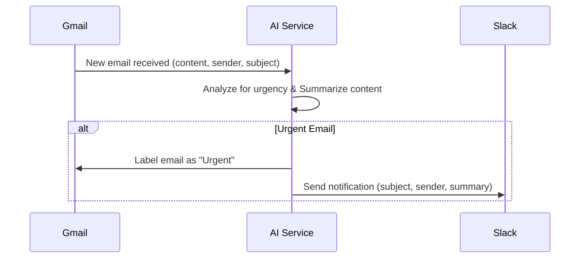

# Email Triage Automation: High-Level Workflow Design

## 1. Overview

This document outlines the high-level design for an automated email triage system. The system will monitor a Gmail inbox, analyze incoming emails for urgency using AI, label urgent emails in Gmail, and send notifications for urgent emails to a Slack channel.

## 2. Workflow Diagram

(Reference to the provided `workflow_diagram.png`)

## 3. Components and Modules

### 3.1. Gmail Integration
    *   Responsibilities:
        *   Monitor the Gmail inbox for new incoming emails.
        *   Fetch the content (subject, sender, body) of new emails.
        *   Apply a label (e.g., "Urgent") to specific emails.
    *   Technology/Tools:
        *   Google API Python Client (`google-api-python-client`).
        *   Gmail API.
        *   OAuth 2.0 for authentication.
        *   Google Cloud Pub/Sub for push notifications (recommended for real-time monitoring).
    *   Data Flow:
        *   Input: Gmail credentials/token, Pub/Sub subscription details.
        *   Output: Email object (subject, sender, body, ID), confirmation of label application.
        *   Key API calls:
            *   `service.users().watch()` to set up push notifications.
            *   Receive notifications via Pub/Sub, then fetch email details using `service.users().messages().get()`.
            *   `service.users().messages().modify()` to add labels.

### 3.2. AI Service (Urgency Analysis & Summarization)
    *   Responsibilities:
        *   Analyze the content of an email to determine its urgency.
        *   Generate a concise summary of the email content.
    *   Technology/Tools:
        *   Python.
        *   Natural Language Processing (NLP) libraries:
            *   For Urgency Detection:
                *   Scikit-learn (`sklearn`) for traditional ML models (Naive Bayes, SVM) after feature engineering (e.g., TF-IDF).
                *   Transformer-based models (e.g., BERT, RoBERTa from Hugging Face `transformers` library) for more advanced classification. This would likely require fine-tuning on a labeled dataset of urgent/non-urgent emails.
                *   Potentially, sentiment analysis libraries if urgency correlates with strong sentiment.
            *   For Summarization:
                *   Hugging Face `transformers` library (e.g., using pre-trained models like BART, T5, Pegasus).
                *   OpenAI API (if external API usage is acceptable) via the `openai` Python library.
                *   NLTK (`nltk`) or spaCy (`spacy`) for more traditional extractive summarization techniques.
    *   Data Flow:
        *   Input: Email content (body, subject).
        *   Output: Urgency score/label (e.g., "Urgent", "Not Urgent"), summarized text.

### 3.3. Slack Integration
    *   Responsibilities:
        *   Send a notification message to a specified Slack channel.
        *   Format the message to include email subject, sender, and summary.
    *   Technology/Tools:
        *   Slack SDK for Python (`slack-sdk`).
        *   Slack API.
        *   Bot token for authentication.
    *   Data Flow:
        *   Input: Slack channel ID, message content (subject, sender, summary).
        *   Output: Confirmation of message sending.
        *   Key API calls:
            *   `client.chat_postMessage()` to send the notification.

## 4. Data Flow and Control Flow

*   **Control Flow:**
    1.  A new email arrives in the Gmail inbox.
    2.  A push notification is sent via Google Cloud Pub/Sub to the application.
    3.  The Gmail Integration module fetches the new email's details (subject, sender, body).
    4.  The email content is passed to the AI Service.
    5.  The AI Service analyzes the email for urgency and generates a summary.
    6.  If the AI Service determines the email is urgent:
        a.  The AI Service instructs the Gmail Integration module to label the email as "Urgent".
        b.  The AI Service passes the email's subject, sender, and summary to the Slack Integration module.
        c.  The Slack Integration module sends a formatted notification to the designated Slack channel.
    7.  If the email is not urgent, no further action is taken by the AI service regarding labeling or Slack notification.
*   **Data Schema (Key Entities):**
    *   `Email`:
        *   `id`: string (Gmail message ID)
        *   `subject`: string
        *   `sender`: string (email address)
        *   `body`: string (email content, likely plain text or HTML)
        *   `timestamp`: datetime
        *   `is_urgent`: boolean (determined by AI)
        *   `summary`: string (generated by AI)
    *   `SlackNotification`:
        *   `channel_id`: string
        *   `text_content`: string (formatted message including subject, sender, summary)
        *   `timestamp`: datetime

## 5. Technology Stack Recommendations

*   Programming Language: Python 3.x
*   Key Libraries/Frameworks:
    *   `google-api-python-client` (for Gmail API)
    *   `google-cloud-pubsub` (for Gmail push notifications)
    *   `slack-sdk` (for Slack API)
    *   NLP/AI Libraries:
        *   Hugging Face `transformers` (recommended for robust urgency detection and summarization)
        *   `scikit-learn` (for simpler urgency detection models if preferred)
        *   `nltk` / `spacy` (for basic summarization alternatives)
        *   (Optional) `openai` (if using OpenAI API for AI tasks)
    *   Web framework (Optional, if a web endpoint is needed for Pub/Sub push): Flask or FastAPI.
    *   `python-dotenv` (for managing environment variables).

## 6. Assumptions and Limitations

*   Assumptions:
    *   User has a Gmail account and a Slack workspace.
    *   Necessary API credentials and tokens (Google Cloud, Slack Bot) can be obtained and securely stored.
    *   A Google Cloud Project is set up for Pub/Sub.
    *   For AI-based urgency detection, either a pre-trained model suitable for the task exists, or a dataset can be created/obtained for fine-tuning/training a custom model.
    *   The definition of "urgent" can be reliably determined by AI from email content.
*   Limitations:
    *   The accuracy of AI-driven urgency detection and summarization depends heavily on the model quality and training data.
    *   Rate limits of Gmail, Google Cloud Pub/Sub, AI service (if using external APIs), and Slack APIs need to be considered.
    *   Handling of complex email formats (e.g., heavily HTML-formatted, multipart emails, attachments) might require additional parsing logic. Attachments themselves are not processed for urgency/summary in this design.
    *   Real-time processing might have slight delays due to API latencies and processing time.
    *   Error handling and retry mechanisms will be crucial for robustness.

## 7. Open Questions and Ambiguities
    *   Specific criteria for "urgency": Will it be purely AI-driven, or will there be keyword-based rules as a fallback or supplement?
    *   Training data for urgency model: If a custom model is needed, how will this data be sourced and labeled?
    *   Slack channel for notifications: Is it a single, fixed channel, or configurable?
    *   Authentication/Authorization: Detailed flow for obtaining and refreshing OAuth tokens for Gmail and Slack.
    *   Deployment environment: Where will this automation run (e.g., local server, cloud function, dedicated server)?
    *   Error logging and monitoring strategy.
    *   Configuration management (e.g., Slack channel ID, Gmail label name).

## 8. Next Steps (Further Research)
    *   Detailed investigation into setting up Gmail API push notifications with Google Cloud Pub/Sub.
    *   Evaluate specific pre-trained models from Hugging Face for text classification (urgency) and summarization.
    *   Outline the OAuth 2.0 flow for both Gmail and Slack integrations within a Python application.
    *   Define a strategy for acquiring/creating and labeling training data if a custom urgency detection model is required. 